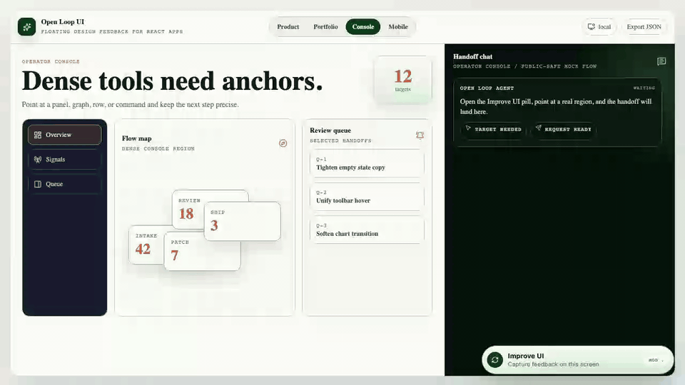
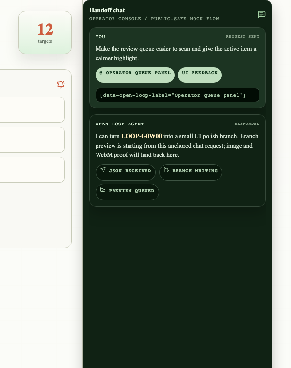
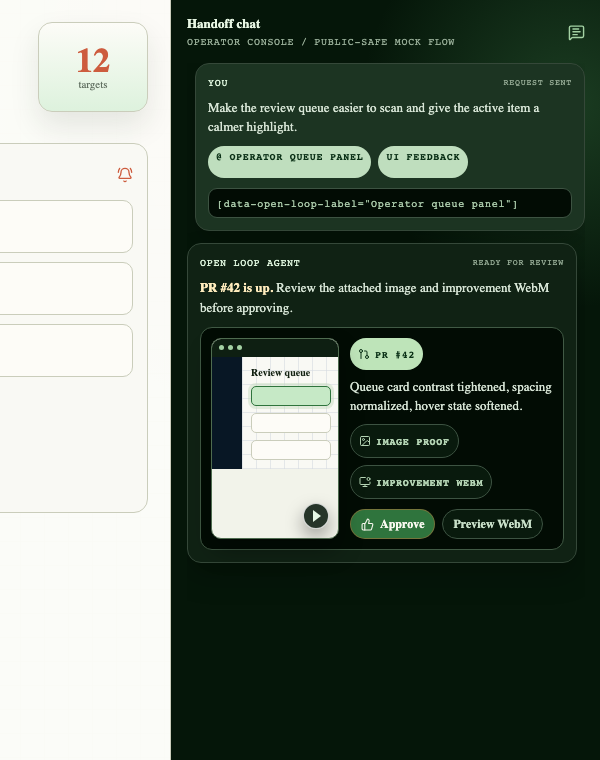
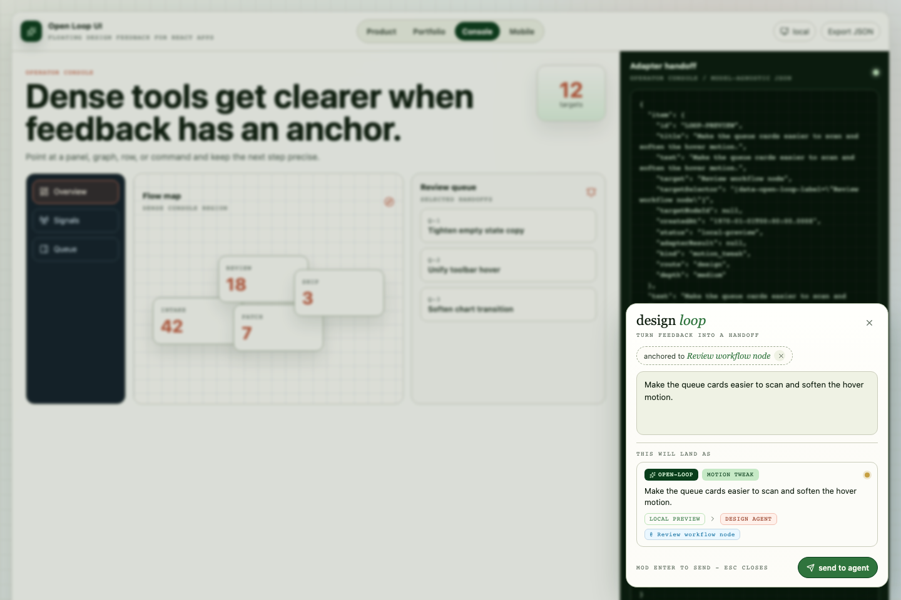

# Open Loop UI

[](https://www.npmjs.com/package/@heyitsalec/open-loop-ui)
[](LICENSE)
[](package.json)

**An in-app design improvement loop for React.**

Point at real UI, describe the change, preview how it will route, and hand the implementation request to your local CLI, agent, issue tracker, or PR flow through a small JSON contract.



[Watch the higher-quality WebM walkthrough](docs/assets/open-loop-demo.webm) | [Get started](docs/getting-started.md) | [Read the adapter contract](docs/adapter-contract.md)

Open Loop UI turns the best part of a design review into a reusable product surface. It keeps feedback inside the app, attached to the DOM element someone actually meant, so technical and non-technical users can move from "this should feel better" to a routed handoff without leaving the moment.

Tiny button, real target, clean handoff.

## What You Just Saw

| Moment | What it means |
| --- | --- |
| **A small floating pill** | The app keeps being the app. Open Loop adds one memorable way to ask for improvement. |
| **A real DOM target** | Add a label like `data-open-loop-label="Revenue chart"` and feedback lands on the right region. |
| **A routing preview** | Vague feedback becomes a visible decision: bug, layout, copy, color, motion, or idea. |
| **An adapter handoff** | Your system decides what happens next: local CLI, agent, issue tracker, PR note, or custom workflow. |

## Install

```bash
npm install @heyitsalec/open-loop-ui
```

Open Loop UI works with React 18 and 19. Import the provider and the package stylesheet, then wrap the part of the app that should be improvable.

```tsx
import { OpenLoopProvider } from '@heyitsalec/open-loop-ui';
import '@heyitsalec/open-loop-ui/styles.css';

export function App() {
  return (
    <OpenLoopProvider
      appId="my-product"
      adapter={async (payload) => {
        const response = await fetch('/api/open-loop', {
          method: 'POST',
          headers: { 'content-type': 'application/json' },
          body: JSON.stringify(payload)
        });
        return response.json();
      }}
    >
      <main data-open-loop-label="Main product canvas">
        <Dashboard />
      </main>
    </OpenLoopProvider>
  );
}
```

For the full setup path, see [Getting Started](docs/getting-started.md).

## Why It Works

### It lives where feedback happens

Open Loop sits inside dashboards, internal tools, mobile shells, portfolio sites, admin pages, or agent workbenches without turning the host app into a feedback app. The component is intentionally small, but the workflow is opinionated: point, write, preview, hand off.

### It anchors intent to the interface

Screenshots and comments are easy to misread. Open Loop records the target label, selector, target rectangle, draft, classification, and app metadata in one payload. The next person, script, or agent can see what the user meant.

### It does not own your workflow

The package never writes files, calls a model provider, creates tickets, or mutates your repo by itself. It collects intent and calls your adapter. You keep control of auth, permissions, queueing, provider choice, and writes.

## Targetable Regions

Add `data-open-loop-label` to any region you want the picker to name clearly:

```tsx
<section data-open-loop-label="Revenue chart">
  <Chart />
</section>
```

Supported target attributes:

| Attribute | Purpose |
| --- | --- |
| `data-open-loop-label` | Gives the region a short human-readable name. |
| `data-open-loop-id` | Creates a stable selector for handoffs. |
| `data-open-loop-node-id` | Adds your own internal node id to the payload. |
| `data-open-loop-ignore="true"` | Keeps app chrome or overlays out of targeting. |

If no label is present, Open Loop falls back to nearby ids, class names, or tag names. The default shortcut is `Cmd+.` on macOS and `Ctrl+.` elsewhere.

## Adapter Contract

Adapters receive one `OpenLoopAdapterPayload` and return one `OpenLoopAdapterResult`. That pair is the stable 0.1 contract.

```ts
import { createCliAdapter } from '@heyitsalec/open-loop-ui/adapters/cli';

export const openLoopAdapter = createCliAdapter({
  command: 'open-loop-agent',
  timeoutMs: 15000
});
```

The CLI adapter is model-agnostic: it runs your command, writes one JSON payload to stdin, and expects one JSON object on stdout. Use it from a Node-capable boundary such as a local server, Electron main process, devtool backend, or script.

```json
{
  "item": {
    "id": "LOOP-K8YTM",
    "title": "Tighten chart spacing",
    "status": "local-preview"
  },
  "text": "Tighten chart spacing",
  "target": {
    "label": "Revenue chart",
    "selector": "[data-open-loop-label=\"Revenue chart\"]"
  },
  "classification": {
    "kind": "layout_tweak",
    "route": "design",
    "depth": "medium"
  },
  "app": {
    "id": "my-product"
  }
}
```

Return:

```json
{
  "ok": true,
  "externalId": "TASK-123",
  "url": "https://example.test/TASK-123",
  "message": "Queued for design review"
}
```

Read the full [Adapter Contract](docs/adapter-contract.md) for browser-safety notes and failure behavior.

## Proof Gallery

The README assets are captured from real Playwright interaction states, not mocked pixels. The component can prove its own UX in review.

| DOM targeting | Live panel |
| --- | --- |
|  |  |

| Message handoff | PR-ready proof |
| --- | --- |
|  |  |

<details>
<summary>See the full captured asset set</summary>

| Hero flow | Floating pill |
| --- | --- |
|  |  |

| Adapter handoff | Targeting crop |
| --- | --- |
|  |  |

The capture flow also writes [open-loop-demo.webm](docs/assets/open-loop-demo.webm) and [open-loop-demo.gif](docs/assets/open-loop-demo.gif).

</details>

## Examples

| Example | What it shows |
| --- | --- |
| [Vite basic](examples/vite-basic) | A small browser app using the provider and package stylesheet. |
| [Next.js route handler](examples/next-route-handler) | A browser-safe provider calling a route handler that owns the handoff. |

Build the static demo with:

```bash
npm run build:demo
```

## Docs Map

| Start | Polish | Ship |
| --- | --- | --- |
| [Getting Started](docs/getting-started.md) | [Theming](docs/theming.md) | [Security](SECURITY.md) |
| [Adapter Contract](docs/adapter-contract.md) | [Accessibility](docs/accessibility.md) | [Contributing](CONTRIBUTING.md) |
| [Vite Example](examples/vite-basic) | [Screenshot Playbook](docs/screenshot-playbook.md) | [Starter Issues](docs/starter-issues.md) |
| [Next.js Example](examples/next-route-handler) | [Changelog](CHANGELOG.md) | [License](LICENSE) |

## Development

```bash
npm install
npm run dev
npm run lint
npm run typecheck
npm test
npm run build
npm run test:e2e:smoke
npm run release:check
```

`npm run test:e2e:smoke` avoids rewriting tracked screenshots. Use `npm run test:e2e` when you intentionally want the full browser suite, including asset refresh. Use `npm run capture` when you only want to refresh the README screenshots, WebM, and GIF under `docs/assets/`; set `OPEN_LOOP_CAPTURE_GIF=0` to skip GIF conversion.

`npm run release:check` runs the full local launch gate: lint, typecheck, unit tests, package build, static demo build, smoke e2e, packed consumer verification, and npm pack dry-run. `npm pack` and `npm publish` also rebuild `dist` through `prepack` so the package does not ship stale output.

## Contributing

Open Loop UI is intentionally small: polished React UI, DOM-anchored intent capture, and adapters that let host apps decide what happens next. Good early contributions are docs, examples, accessibility polish, adapter recipes, theme presets, and focused tests.

Read [Contributing](CONTRIBUTING.md), browse [Starter Issues](docs/starter-issues.md), and report security issues through the [Security Policy](SECURITY.md).

## License

MIT. See [LICENSE](LICENSE).
