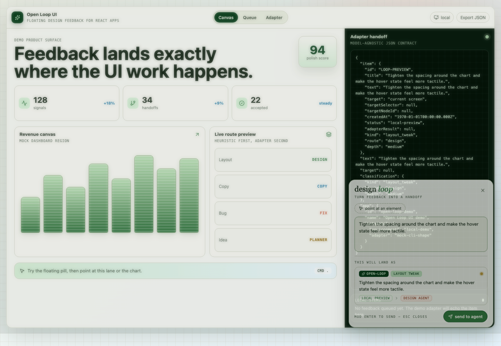
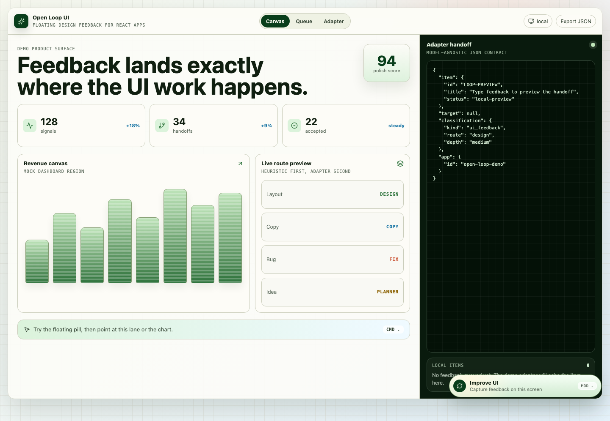
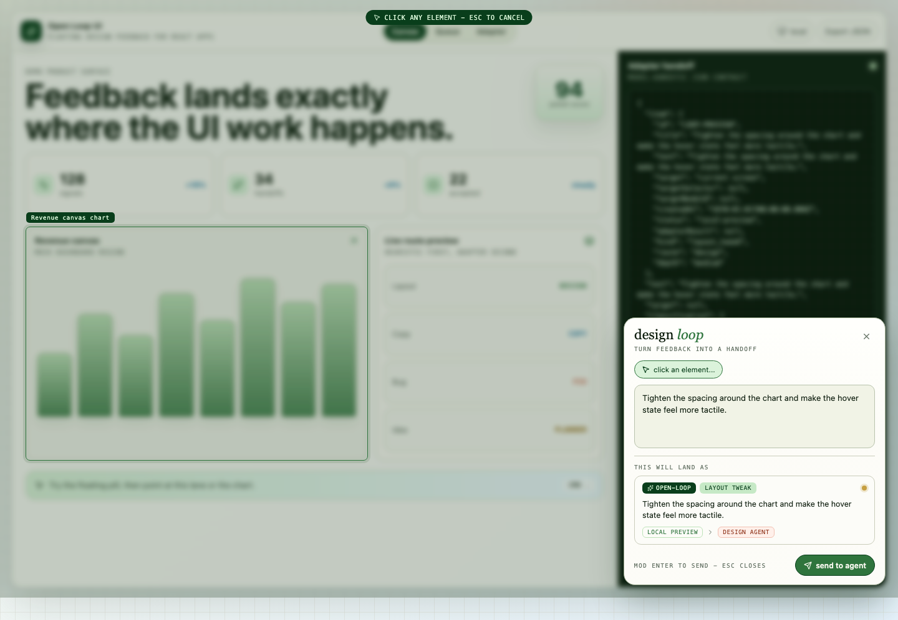
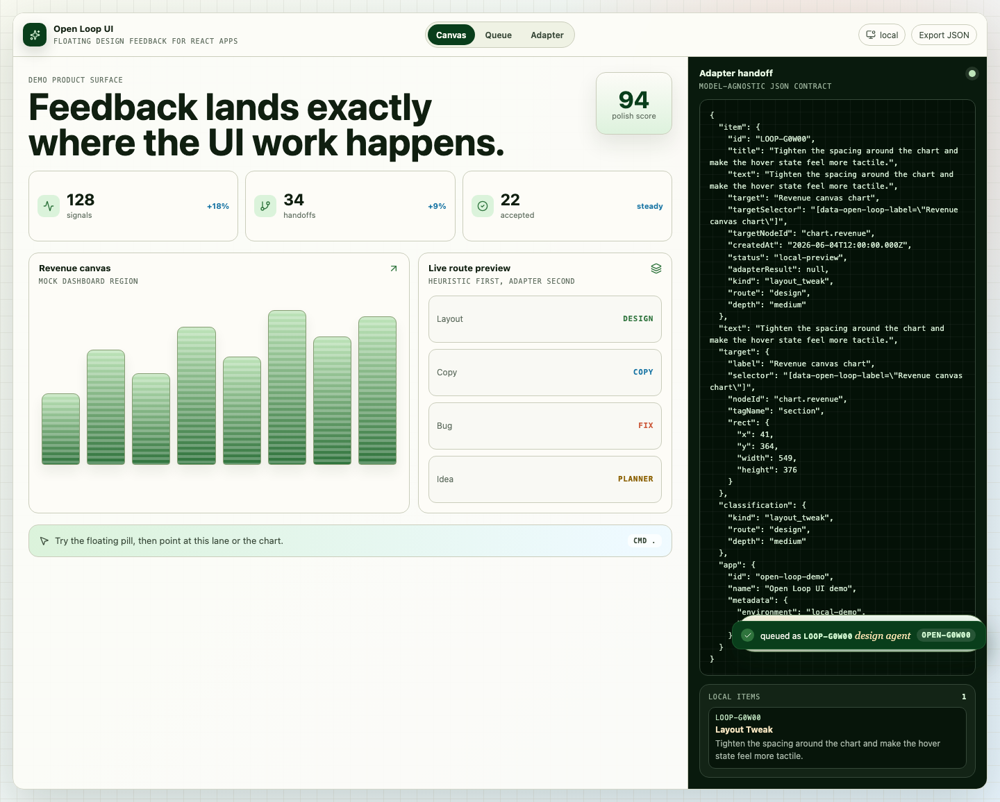

# Open Loop UI



A drop-in floating design feedback loop for React apps. Tiny button, big opinions.

Open Loop UI turns the best part of a design review into a reusable component: point at a real DOM element, describe the improvement, preview how it will route, and hand the request to any local CLI or agent through a small JSON contract.

It is meant to sit inside almost any application: dashboards, mobile shells, internal tools, portfolio sites, weird little agent workbenches, or the admin page nobody admits they use every day. The app keeps being the app. Open Loop just gives it a cheerful little “make this better” button.

```bash
npm install @alecbot/open-loop-ui
```

```tsx
import { OpenLoopProvider } from '@alecbot/open-loop-ui';
import '@alecbot/open-loop-ui/styles.css';

export function App() {
  return (
    <OpenLoopProvider
      appId="my-product"
      adapter={async (payload) => {
        const response = await fetch('/api/open-loop', {
          method: 'POST',
          headers: { 'content-type': 'application/json' },
          body: JSON.stringify(payload)
        });
        return response.json();
      }}
    >
      <main data-open-loop-label="Main product canvas">
        <Dashboard />
      </main>
    </OpenLoopProvider>
  );
}
```

## Why It Stands Out

- It feels like a real product surface, not a comment box bolted to a page.
- The floating pill is small, memorable, keyboard-friendly, and ready for screenshots.
- Element targeting uses real DOM labels: add `data-open-loop-label="Revenue chart"` and the handoff knows exactly where the feedback belongs.
- The preview turns vague feedback into a visible routing decision: bug, copy, layout, color, motion, or idea.
- Playwright captures the proof states, so a PR can show the actual recorded UI image right in the review/chat thread instead of asking people to imagine it.
- The package never writes files or calls a provider directly. It collects intent and sends JSON to your adapter.

## The Fun Bit

Open the pill, click a real element, and Open Loop records the label, selector, target rectangle, draft, classification, and app metadata. That payload can become a Linear issue, a local agent task, a design review note, a Codex prompt, a GitHub PR comment, or whatever your team uses to keep work moving.

The demo already captures four README-ready Playwright images:

- the quiet floating pill
- the DOM element targeting overlay
- the live routing panel
- the adapter handoff after submit

The next obvious flourish is a short recorded video/GIF of the same flow, embedded in the PR conversation when the project goes public. Not required for the MVP. Extremely good demo energy.

## Screenshots

| Floating pill | Element targeting |
|---|---|
|  |  |

| Live panel | Adapter handoff |
|---|---|
|  |  |

## CLI Adapter Contract

The CLI adapter is model-agnostic. It runs your command, writes one JSON payload to stdin, and expects one JSON object on stdout.

Use it from a Node-capable boundary such as a local server, Electron main process, devtool backend, or script:

```ts
import { createCliAdapter } from '@alecbot/open-loop-ui/adapters/cli';

export const openLoopAdapter = createCliAdapter({
  command: 'open-loop-agent',
  timeoutMs: 15000
});
```

```json
{
  "item": {
    "id": "LOOP-K8YTM",
    "title": "Tighten chart spacing",
    "status": "local-preview"
  },
  "text": "Tighten chart spacing",
  "target": {
    "label": "Revenue chart",
    "selector": "[data-open-loop-label=\"Revenue chart\"]"
  },
  "classification": {
    "kind": "layout_tweak",
    "route": "design",
    "depth": "medium"
  },
  "app": {
    "id": "my-product"
  }
}
```

Return:

```json
{
  "ok": true,
  "externalId": "TASK-123",
  "url": "https://example.test/TASK-123",
  "message": "Queued for design review"
}
```

## Development

```bash
npm install
npm run dev
npm run lint
npm run typecheck
npm test
npm run build
npm run test:e2e
```

`npm run test:e2e` also refreshes the README screenshots under `docs/assets/`.

## Docs

- [Getting started](docs/getting-started.md)
- [Adapter contract](docs/adapter-contract.md)
- [Theming](docs/theming.md)
- [Accessibility](docs/accessibility.md)
- [Screenshot playbook](docs/screenshot-playbook.md)
- [Launch map](docs/launch-map.md)
- [Star growth playbook](docs/star-growth-playbook.md)
